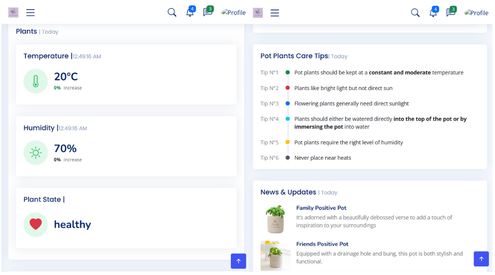

# 🌿 _Smart Plant Pot Monitoring System_

A smart plant pot monitoring system using Cloud of Things technologies that allows users to monitor their plants in real-time.
The system provides automatic watering, cooling, sunlight, and can detect plant diseases and defects. This project aims to deliver the following functionalities:

1. **Monitor Climate Variables**: Measure temperature, humidity, and light levels.
2. **Automated Actions**: Automatically water, light, or adjust the ambient temperature when any climatic parameter crosses the safety threshold, ensuring the plants are protected.
3. **Anomaly Detection**: Alert users if an anomaly is detected based on images retrieved from the camera.
4. **Proximity Alerts**: Notify users when they are near the plant and the water level in the pump reaches a pre-defined threshold using Location-Based Services (LBS).

The system architecture is depicted in the following diagram:


### 🛠️ System Components:

The system is composed of the following hardware:

1. **🖥️ Raspberry Pi 4 Model B**: The main computing unit.
2. **📷 Raspberry Pi Wide Angle Camera Module**: Captures images for plant anomaly detection.
3. **🌡️ DHT11 Temperature and Humidity Sensor**: Monitors the climate parameters.

---

### 💻 Technologies:

To achieve the different functionalities of the project, the following technologies and frameworks are employed:

#### 🛠️Backend:

1. **📡 MQTT**: A lightweight messaging protocol for communication between IoT components. We use **Mosquitto** as the MQTT broker to decouple communication between devices.
2. **🗄️ MongoDB**: A NoSQL document-oriented database used to store sensor data and user information.
3. **🔗 Node-Red**: An open-source tool used to manage the data flow between sensors.


The class diagram below represents the structure and different components of a system to help view the application. 


#### 🏗️Middleware:

1. **☕ Jakarta Enterprise Edition**: A Java-based framework for developing APIs to enable communication between different applications, known for its high level of security.
2. **🚀 WildFly**: A lightweight Java Enterprise Edition application server developed by Red Hat, providing the necessary functionalities to run Java web applications.

#### 🤖Machine Learning model:

1. **🧠 SVM (Support Vector Machine)**: A supervised learning algorithm used for classification tasks. In this project, SVM is applied to detect plant anomalies based on images captured by the camera, using the Bag of Features (BoF) technique for feature extraction.

#### 🌐Frontend:

1. **📱 PWA (Progressive Web Application)**: Web applications that provide a native app-like experience using service workers, manifests, and other web technologies for seamless user experience.



### ☁️ Deployment

This section outlines the steps to deploy the Smart Plant Pot Monitoring System using Azure VM and various technologies. 

#### 🖥️ Development Environment (Windows)

1. **Install Oracle JDK 21**: Ensure you download the official JDK from Oracle.
2. **Set JAVA_HOME**: Define the `JAVA_HOME` environment variable.

   ```bash
   set JAVA_HOME=C:\path\to\your\jdk
   ```
#### 🌐 Production Environment (Azure Virtual Machine)
##### 🖥️ SSH into the VM
Connect to your Azure VM using the following command:

  ```bash
  ssh -i ~/Downloads/CoTProject_key.pem azureuser@102.37.143.107
  ```
##### 📦 Install Required Packages
```bash
sudo apt install wget apt-transport-https gnupg2 software-properties-common
```
##### ☕ Install Java JDK 21
```bash
wget https://download.oracle.com/java/21/latest/jdk-21_linux-x64_bin.tar.gz
tar -xvf jdk-21_linux-x64_bin.tar.gz
sudo mv jdk-21.0.1 /opt/
```
Set JAVA_HOME in your ~/.bashrc:

```bash
echo "export JAVA_HOME=/opt/jdk-21.0.1" >> ~/.bashrc
echo "export PATH=\$PATH:\$JAVA_HOME/bin" >> ~/.bashrc
source ~/.bashrc
```
##### 🌐 Install WildFly
1. **Download and set up WildFly:**
```bash
wget https://github.com/wildfly/wildfly/releases/download/30.0.0.Final/wildfly-30.0.0.Final.zip
unzip -xvf wildfly-30.0.0.Final.zip
sudo mv wildfly-30.0.0.Final /opt/wildfly
``` 
2. **Change Ownership**:
```bash
sudo mv wildfly-30.0.0.Final /opt/wildfly
``` 
3. **Create a dedicated WildFly user:**
```bash
sudo groupadd --system wildfly 
sudo useradd -s /sbin/nologin --system -d /opt/wildfly -g wildfly wildfly
```
4. **Set up WildFly as a service:**
```bash
sudo cp /opt/wildfly/docs/contrib/scripts/systemd/wildfly.service /etc/systemd/system/
sudo cp /opt/wildfly/docs/contrib/scripts/systemd/wildfly.conf /etc/wildfly/
```
5. **Start WildFly service:**
enable and start the service:
```bash
sudo systemctl daemon-reload
sudo systemctl start wildfly
sudo systemctl enable wildfly
```
##### 📡 Install MQTT Broker
sensors will communicate and send data to the middleware via the MQTT Broker. These are the steps to install and configure the open source MQTT Broker Mosquitto:
1. **Install Mosquitto:** To install Mosquitto, type the following commands:
```bash
sudo apt update
sudo apt upgrade
sudo apt install wget apt-transport-https gnupg2 software-properties-common
sudo add-apt-repository ppa:mosquitto-dev/mosquitto-ppa
sudo apt install mosquitto mosquitto-clients
```
You can verify that Mosquitto has been installed by typing "mosquitto -version".

2. **Create MQTT username and password:**
To block the broker from unintended connections, create a user and password for this broker with the following command:
```bash
sudo mosquitto_passwd -c /etc/mosquitto/passwd username
```
3. **Generate Dellphi-Helman parameters:**
For more security measures, generate Dhparam.pem with the command below:
```bash
sudo openssl dhparam -out /etc/ssl/certs/dhparam.pem 2048
```
4. **Configure MQTT ports and security:**
To choose the ports for websocket connection
and to use theletsencrypt certificates generated earlier, modify the mosquitto configuration file in /etc/mosquitto/conf.d/default.conf:
```
listener 1883
password_file /etc/mosquitto/passwd
listener 8883
certfile /etc/mosquitto/certs/fullchain.pem
cafile /etc/ssl/certs/ISRG_Root_X1.pem
keyfile /etc/mosquitto/certs/privkey.pem
dhparamfile etc/ssl/certs/dhparam.pem
listener 8083
protocol websockets
certfile /etc/mosquitto/certs/fullchain.pem
cafile /etc/ssl/certs/ISRG_Root_X1.pem
keyfile /etc/mosquitto/certs/privkey.pem
dhparamfile /etc/ssl/certs/dhparam.pem
```
5. **Restart the broker:**
To save and enable these modifications, restart the broker:
```bash
sudo systemctl restart mosquitto
```
Verify that there were no issues in the configuration with the command:
```bash
sudo systemctl status mosquitto
```
With this, we can access the broker over SSL connection to the broker and in particular
over websockets and SSL.

### 🎥Demo:

Here is a demonstration of the Smart Plant Pot Monitoring System:
<div style="text-align: center;">
    
</div>

